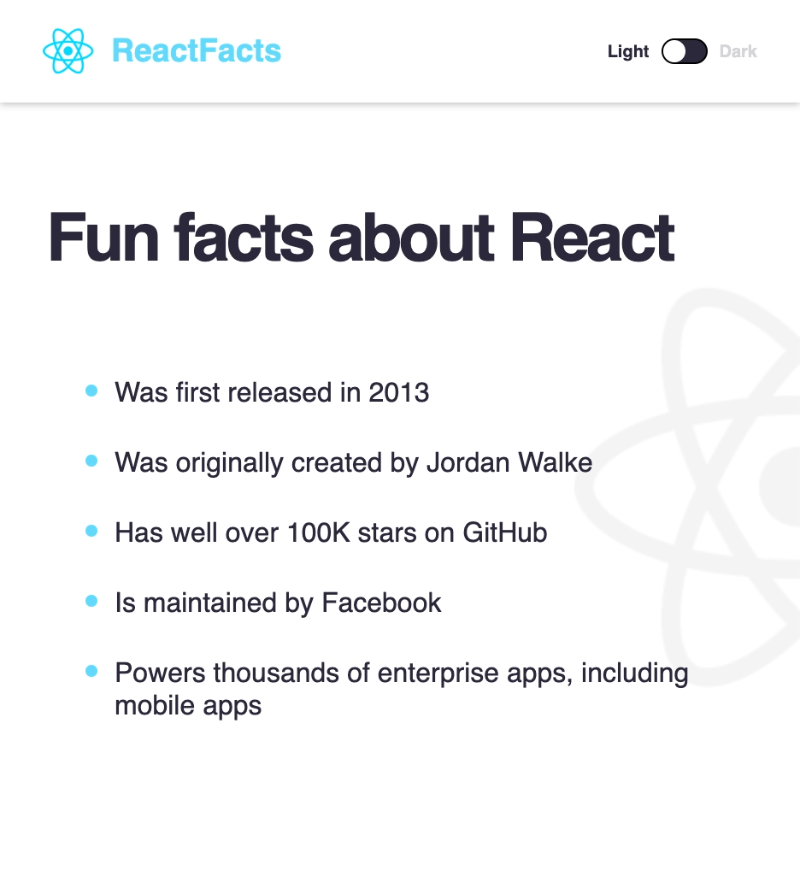

# React Basics: React Facts

## Project Overview

"React Basics: React Facts" is a project designed to simulate a real-world professional environment where developers are required to jump into an existing codebase and implement new features. The challenge was to add dark and light mode functionality to a web application using React. This involved understanding an existing codebase, setting up a toggle function, managing state variables, and correctly passing these variables as props to various components.

This project is based on a tutorial from Scrimba. You can find the tutorial here: [Add dark/light modes to ReactFacts site](https://scrimba.com/learn/frontend/warm-up-add-dark-light-modes-to-reactfacts-site-co5924409bb476cc78b0d818a).

## Key Features

- **Dark/Light Mode Toggle**: Implemented a toggle switch to change the application's theme.

### Light Mode


### Dark Mode


- **React State Management**: Created a state variable to keep track of the current theme mode (dark or light).
- **Props in React**: Passed the state variable and the toggle function as props to child components to control their rendering and behavior based on the current theme.

## Learning Highlights

### Passing State as Props in React

In React, state variables do not automatically become available as props in child components. Instead, they need to be explicitly passed down. This project offered a practical application of this concept:

1. **Explicit Data Flow**: React's design emphasizes explicit data flow, making it clear where data comes from and how it's passed around in an application.
   
2. **Passing Props to Child Components**: In the "React Facts" project, the `darkMode` state variable and `toggleDarkMode` function were passed from the `App` component to the `Navbar` and `Main` components as props.
   

    ```jsx
    <Navbar darkMode={darkMode} toggleDarkMode={toggleDarkMode} />
    <Main darkMode={darkMode} />
    ```


# React + Vite

This template provides a minimal setup to get React working in Vite with HMR and some ESLint rules.

Currently, two official plugins are available:

- [@vitejs/plugin-react](https://github.com/vitejs/vite-plugin-react/blob/main/packages/plugin-react/README.md) uses [Babel](https://babeljs.io/) for Fast Refresh
- [@vitejs/plugin-react-swc](https://github.com/vitejs/vite-plugin-react-swc) uses [SWC](https://swc.rs/) for Fast Refresh
